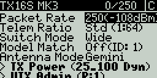
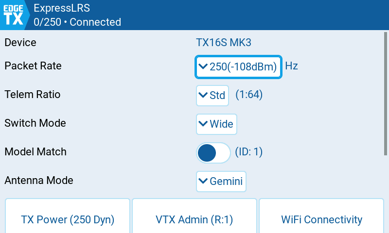
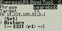
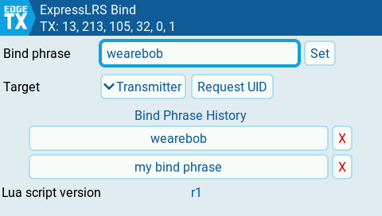
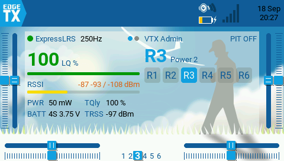
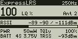
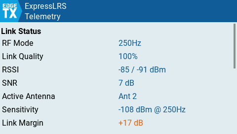
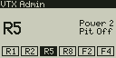
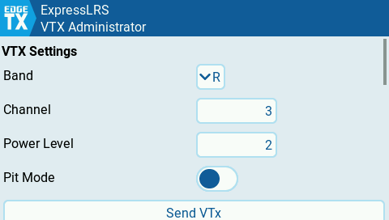

# ExpressLRS Lua Scripts

This repository is home to the ExpressLRS Lua tool scripts for module configuration and widgets.

## Installation

* Delete any old ELRS scripts (`elrs.lua`, `elrsV2.lua`, `elrsV3.lua` and their `.luac` counterparts) from `SCRIPTS/TOOLS/`
* Copy the contents of the `src/` directory to the **root** of your radio's SD card, preserving the directory structure and overwriting any existing files

## ExpressLRS Configuration Tool

The main tool (`ExpressLRS`) lets you configure your ExpressLRS transmitter and receiver settings, adding native GUI controls for radios that support them and falling back to the traditional text display for B&W radios.

 

## ExpressLRS Bind Phrase Manager

The bind tool (`ExpressLRS Bind`) provides a quick access Bind button, as well as the ability to enter a new bindphrase on a receiver or transmitter, and works with both GUI and B&W screens. The bindphrase supports entering a UID directly and a history is maintained for quick swapping. Setting the phrase over MSP requires **ExpressLRS 4.1+** on the target device.

 

## Widgets

Widgets require a GUI screen. Both widgets running side-by-side on the home screen:

## ELRS Telemetry Widget

The telemetry widget (`ExpressLRS Telemetry`) displays real-time link statistics on your home screen. Larger widget sizes show more information and long press to open a fullscreen view showing all the telemetry items in a list.

Black & white radios get the same telemetry as a telemetry screen: select the `ELRTLM` script on a page in Model Setup > Telemetry. The screen shows link quality, RSSI, RF mode, power and battery; press ENTER for the full list.

 

## VTX Administrator Widget

The VTX Administrator widget (`ExpressLRS VTX Admin`) is a shortcut for editing the VTX Admin settings normally accessed from the ExpressLRS tool script. It supports binding VTX channels to a 6POS for switching channels without digging into menus, with multiple profiles. Long press the widget to open the fullscreen configuration UI.

Black & white radios get the same features as a telemetry screen: select the `ELRVTX` script on a page in Model Setup > Telemetry. The screen shows the current band, channel, power, pit mode and 6POS presets; press ENTER for settings.

 

## Compatibility

| Radio type | Firmware | ExpressLRS |
|------------|----------|------------|
| Black & white LCD | EdgeTX 2.11.6+, 2.12.1+, or 3.0+ | v3.5.4+ |
| Color LCD | EdgeTX 2.11.6+, 2.12.1+, or 3.0+ | v3.5.4+ |

The bind phrase manager additionally requires **ExpressLRS 4.1+**

## Legacy Script

[`legacy/`](legacy/) holds `elrs.lua`, the original single-file configuration tool lua meant for radios that do not support the minimum versions listed in [Compatibility](#compatibility), or do not have enough RAM to run the new tool script.

## Development

See [docs/development.md](docs/development.md) for the tool's internal architecture and the CRSF simulator used for testing inside the EdgeTX simulator. The lua config tool is no longer maintained in the main [ExpressLRS repository](https://github.com/ExpressLRS/ExpressLRS/).
